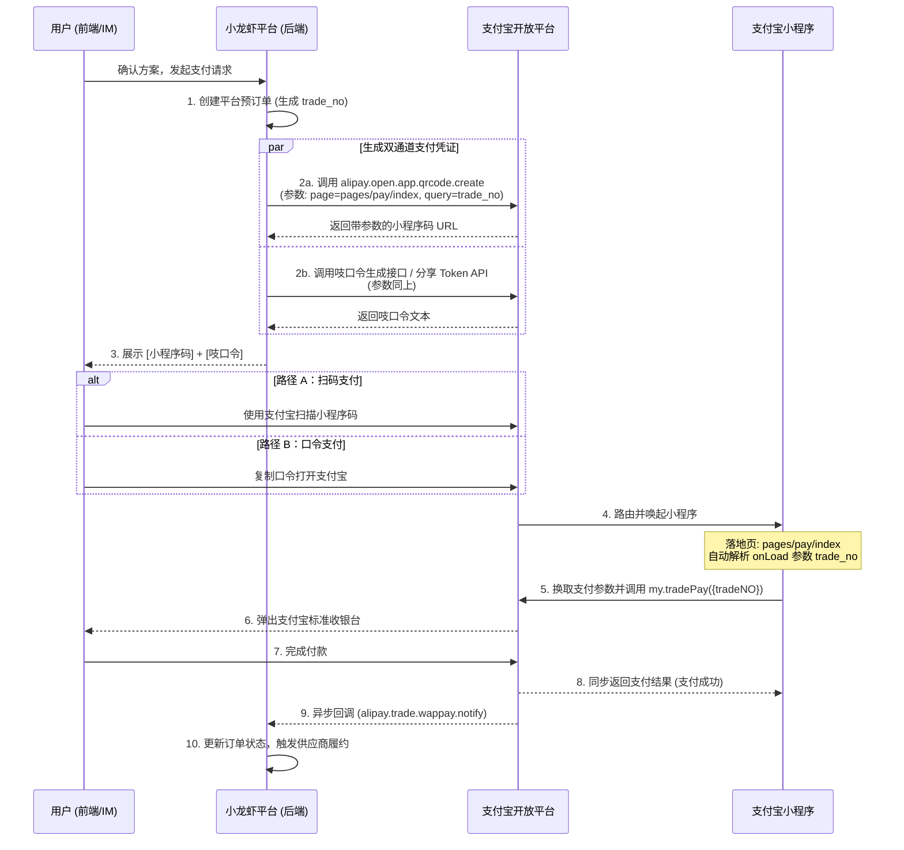

# 小龙虾旅行反向撮合平台 -- 综合需求分析报告（V2.0 修订版）

> 修订说明：本版本基于 V1.0 分析报告，融合产品架构师深度诊断意见，
> 在退改风控、农历日期、支付落地、订单降级、Saga 事务粒度、身份收集 UX、价格合规展示
> 等 7 个维度进行了系统性修正。所有修订均以"在中国航旅市场可落地"为底线标准。

---

## 1. 需求解析总览

### 1.1 产品定位与核心价值

本产品定位为 **AI 驱动的寒暑假旅行反向撮合平台**。核心模式：用户提交预算和需求后，系统作为"招标方"向供应商发起反向竞价，最终锁定 5 套完整可履约方案供用户选择。

核心价值主张三层：

- **省心**：一次输入需求，AI 自动完成"交通+酒店+门票+退改保障"四合一整单撮合，杜绝分次购买库存不同步
- **可信**：每套方案明确展示供应商主体（OTA 自营或入驻旅行社），订单在支付宝小程序内闭环管理，可追溯、可售后
- **无压力**：100 元退改保障费用由平台风控模块兜底，实现"随便选、随便退"的零决策压力体验

### 1.2 目标用户画像

| 维度 | 特征 |
|------|------|
| 人群 | 有学龄子女的家庭、大学生寒暑假出行群体 |
| 预算敏感度 | 中等偏价格敏感，有固定总预算，追求全包透明 |
| 时间灵活度 | 高 -- 能接受非高峰日期换取更好价格 |
| 技术能力 | 一般 -- 需要简洁支付方式和清晰订单管理 |
| 信任门槛 | 较高 -- 需要看到供应商实体、订单入口、退款保障 |

### 1.3 与现有方案的关键差异

| 差异点 | 传统 OTA | 小龙虾旅行 |
|--------|---------|------------|
| 撮合方向 | 用户主动搜索比价 | 系统反向向供应商招标 |
| 库存模式 | 逐项锁定，易库存不同步 | 优先锁定供应商"机+酒套餐"整单，降低库存不同步概率 |
| 退改保障 | 根据产品规则，往往有损 | 平台风控资金池 + 供应商退改政策对冲，实现用户侧全额无损退 |
| 供应商透明度 | 部分隐藏供应商主体 | 强制展示供应商类型与名称 |
| 支付冗余 | 单一支付入口 | 当面付二维码 + 支付宝小程序吱口令双通道 |
| 信息收集理由 | 无明确理由，用户抵触 | 以"锁真实库存"为合理理由前置收集，辅以信任背书动效 |
| 订单归属 | 分散在各平台 | 统一收归商家支付宝小程序，辅以短信/旺旺行程通知 |

---

## 2. 核心业务流程梳理

### 2.1 完整用户旅程

```
[Phase A: 身份收集（含信任引导）]
  Step 1:  用户启动技能
  Step 2:  系统展示信任引导层：
           - 顶部：PRD 隐私安抚话术（"仅用于本次锁单，使用后自动删除"）
           - 中部：滚动展示真实锁单降价案例动效（"张女士节省 ¥1,200"）
           - 底部：平台资质徽章（营业执照/支付宝认证/退改服务合作方 Logo）
  Step 3:  用户填写：称呼(可选) + 手机号 + 出行人姓名 + 证件号
  Step 4:  系统 AES-256-GCM 加密存储，启动 TTL 自动销毁计时
                |
[Phase B: 需求解析]
  Step 5:  用户用自然语言输入出行需求
  Step 6:  NLP 引擎（Claude Structured Output）解析为结构化查询
  Step 7:  日期校验引擎校验：
           - 暑期窗口：7.1-7.14 + 8.16-9.30（剔除 7.15-8.15 高峰）
           - 寒假窗口：动态农历计算，剔除腊月廿三至正月十五
  Step 8:  校验不通过则引导调整；通过则向用户确认结构化需求摘要
                |
[Phase C: 反向招标 + 库存锁定]
  Step 9:  向 OTA 自营 + 入驻旅行社发起招标，优先请求"机+酒套餐（Package）"报价
  Step 10: 各供应商返回套餐报价（含套餐内部库存锁定承诺）
  Step 11: 平台补充门票查询，组合为完整全包方案
  Step 12: Ranking Engine 排序取 Top 5，强制价格拆分：基础费用 + 100 元退改保障
  Step 13: 对 5 套方案执行锁定：
           - 套餐锁定：由 OTA 侧锁定（机+酒整单），平台仅管理锁定状态
           - 门票锁定：平台直接对接景区/票务 API
           - 退改保障：Risk Control 模块冻结 100 元/单到风控资金池
  Step 14: 为每套方案生成：支付宝当面付二维码 + 小程序吱口令
  Step 15: 启动 15 分钟全局倒计时
                |
[Phase D: 方案展示 + 支付]
  Step 16: 前端展示 5 张方案卡片（价格拆分、供应商、倒计时、二维码、口令）
  Step 17: 用户选择一套：
           - 路径 A：扫描二维码 -> 支付宝当面付 -> 支付成功
           - 路径 B：复制吱口令 -> 打开支付宝 -> 唤起小程序收银台 -> 支付成功
  Step 18: 支付回调 -> 订单建档（商家支付宝小程序订单 + 短信行程确认）
  Step 19: 其余 4 套方案锁定自动释放，风控资金池冻结额度解冻
                |
[Phase E: 履约 + 售后]
  Step 20: 供应商自动履约（出票、订房、预约景点、发送行程单）
  Step 21: 用户在商家支付宝小程序内查看和管理订单
  Step 22: 如需退款 -> Risk Control 模块执行：
           - 先向供应商发起退改（利用套餐自带取消险回收部分成本）
           - 差额由平台风控资金池补足
           - 用户侧全额原路退回，体验为"无损退"
  Step 23: 身份信息在订单完结/超时后自动清除，写入审计日志
```

### 2.2 关键路径（MVP P0 -- 全部必须实现）

| 编号 | 功能 | 优先级 | V2.0 修订说明 |
|------|------|--------|--------------|
| C-1 | 身份信息加密收集 + 信任引导 UX | P0 | 新增信任背书动效与隐私安抚话术，降低漏斗断崖 |
| C-2 | NLP 需求解析 | P0 | 不变 |
| C-3 | 寒暑假日期窗口 + 高峰剔除（含农历） | P0 | **提升**：农历计算从 Phase 2 提前至 Phase 1，废除公历硬编码 |
| C-4 | 供应商招标（优先套餐模式） | P0 | **修订**：优先请求 OTA "机+酒 Package"，非散客逐项锁定 |
| C-5 | 库存锁定（OTA 套餐锁 + 门票锁 + 风控冻结） | P0 | **修订**：Saga 深度从 4 层降至 2-3 层 |
| C-6 | 15 分钟倒计时 + 自动释放 | P0 | 不变 |
| C-7 | 双通道支付（当面付二维码 + 小程序吱口令） | P0 | **修订**：口令通过支付宝小程序 Share Token 落地 |
| C-8 | 支付回调 + 订单建档（小程序内闭环） | P0 | **修订**：订单归商家支付宝小程序，非淘宝"我的订单" |
| C-9 | 退改风控模块（资金池 + 对冲） | P0 | **新增**：替代原"保险 API 对接" |
| C-10 | 前端价格拆分合规展示 | P0 | **新增**：总价 = 基础费用 + 100 元退改保障，强制拆分 |

### 2.3 锦上添花（后续迭代）

| 编号 | 功能 | 优先级 |
|------|------|--------|
| N-1 | 淘宝"我的订单"写入（需申请 ISV 资质） | P1 |
| N-2 | 多人/家庭出行联合收集 | P1 |
| N-3 | 智能行程推荐（基于历史偏好） | P2 |
| N-4 | 供应商评分系统 | P2 |
| N-5 | 价格走势预测 | P3 |

### 2.4 核心数据流（V2.0 修订）

```
User Input (NL)
    |
    v
[NLP Service] --> Structured Query {destination, dates, budget, pax, prefs}
    |
    v
[Date Validator] --> Filtered Date Windows
    |                 暑期：公历固定剔除 7.15-8.15
    |                 寒假：农历库动态计算腊月廿三~正月十五 -> 转公历后剔除
    |
    v
[Bidding Engine] --> Fan-out to N suppliers
    |                优先请求"机+酒 Package 套餐"报价（含套餐锁定承诺）
    |                辅助：独立门票查询
    |
    |   [OTA-A: Package]  [OTA-B: Package]  [旅行社-C: Package] ...
    |        |                   |                   |
    |        v                   v                   v
    |   Quote + Lock Promise  Quote + Lock Promise  Quote + Lock Promise
    |
    v
[Ranking Engine] --> Top 5 packages
    |                强制拆分：base_price + 100 元退改保障
    |                强制附带：supplier_name, supplier_type
    |
    v
[Lock Orchestrator] --> 2-3 层 Saga（vs 原 4 层）
    |   Layer 1: OTA 套餐锁定（机+酒由 OTA 侧事务保证）
    |   Layer 2: 门票锁定（平台对接景区 API）
    |   Layer 3: Risk Control 冻结 100 元/单
    |   失败补偿：逆序释放 + 候补方案替补
    |
    v
[Payment Module]
    |   Channel A: alipay.trade.precreate -> QR Code（当面付）
    |   Channel B: Mini Program Share Token -> 吱口令文本
    |   两者绑定同一 out_trade_no，任一成功另一失效
    |
    v
[Timer Service] --> 15-min countdown
    |   Redis TTL + Delayed Queue + Keyspace Notification 三重保障
    |
    v
[Payment Callback] --> Order Creation
    |   订单归属：商家支付宝小程序（主）
    |   辅助通知：短信行程单 + 旺旺消息（如有淘宝授权）
    |
    v
[Fulfillment] --> Supplier auto-fulfill + PII auto-delete

[Risk Control Module] (贯穿全流程)
    |   锁定时：冻结 100 元/单到风控资金池
    |   支付后：持有冻结，等待履约完成或退改触发
    |   退改时：先向 OTA 发起退改（利用套餐自带取消险回收）-> 差额由资金池补足 -> 用户全额退
    |   履约完成：解冻 100 元，计入平台收入
```

---

## 3. 技术架构建议

### 3.1 推荐技术栈（V2.0 修订）

| 层级 | 技术选型 | 选型理由 |
|------|---------|---------|
| **前端** | Next.js 15 + React 19 + TailwindCSS | SSR 优化首屏；倒计时实时更新；信任引导动效渲染 |
| **支付宝小程序** | Taro 3 / 原生支付宝小程序 | **新增**：吱口令解析载体 + 订单管理闭环 + 收银台唤起 |
| **IM 机器人端** | 轻量 SDK + WebSocket | PRD 明确需要 IM 渠道，口令在此场景为主力支付方式 |
| **API 网关** | 阿里云 API Gateway | 与支付宝/淘宝生态集成最优；限流、认证、日志 |
| **核心后端** | Go (Gin/Fiber) | 高并发招标 + 套餐锁定场景需高吞吐，Go 的并发模型适配 Saga 编排 |
| **NLP 服务** | Claude API (Structured Output) | 自然语言需求解析，结构化输出保证下游可消费 |
| **农历服务** | lunar-go / chinese-calendar | **提升至核心依赖**：寒假高峰日期动态计算 |
| **任务调度** | Redis + Asynq (Go) | 15 分钟倒计时、自动释放、退改异步处理 |
| **数据库** | PostgreSQL (阿里云 RDS) | 事务性强、JSONB 存方案快照、行级安全策略 |
| **缓存/锁** | Redis (阿里云 Tair) | 分布式锁、库存锁状态、倒计时 TTL |
| **加密** | AES-256-GCM + 阿里云 KMS | PII 加密存储；密钥托管在 KMS，不进代码/环境变量 |
| **支付** | 支付宝开放平台 SDK（当面付 + 小程序支付） | 当面付生成二维码；小程序生成吱口令 + 收银台 |
| **风控资金** | 支付宝资金预授权 / 平台自有账户体系 | **新增**：退改保障的资金冻结与对冲结算 |
| **部署** | Docker + 阿里云 ACK (K8s) | 国内用户为主，全面对齐阿里云生态 |
| **监控** | Prometheus + Grafana + 阿里云 ARMS | 锁定成功率、支付转化率、退改资金池水位、漏斗转化 |

### 3.2 系统架构（V2.0 模块化单体 + 小程序）

```
+--------------------------------------------------------------+
|                   阿里云 API Gateway                          |
|   Rate Limiting / Auth / Logging / Request Routing            |
+--------------------------------------------------------------+
       |              |              |              |
+------------+  +----------+  +-----------+  +----------------+
| Web 前端    |  | IM Bot   |  | Skill 端   |  | 支付宝小程序    |
| (Next.js)  |  | (WS/SDK) |  | (HTTP)    |  | (订单+收银台)  |
+------------+  +----------+  +-----------+  +----------------+
       \              |              |              /
+--------------------------------------------------------------+
|              Core Application (Modular Monolith)              |
|                                                               |
|  +-------------------+  +--------------------+                |
|  | Identity Module   |  | NLP Module         |                |
|  | - PII Collection  |  | - Intent Parse     |                |
|  | - Trust UX Config |  | - Param Extract    |                |
|  | - AES-256 + KMS   |  | - Lunar Date Calc  |                |
|  | - TTL Auto Delete |  | - Peak Exclusion   |                |
|  +-------------------+  +--------------------+                |
|                                                               |
|  +-------------------+  +--------------------+                |
|  | Bidding Module    |  | Lock Module        |                |
|  | - Package-First   |  | - OTA Package Lock |                |
|  |   Supplier Query  |  | - Ticket Lock      |                |
|  | - Ticket Query    |  | - 15-min Timer     |                |
|  | - Rank & Filter   |  | - Saga Compensate  |                |
|  | - Price Breakdown |  | - Auto Release     |                |
|  +-------------------+  +--------------------+                |
|                                                               |
|  +-------------------+  +--------------------+                |
|  | Payment Module    |  | Order Module       |                |
|  | - QR (precreate)  |  | - MiniApp Order    |                |
|  | - 吱口令 (Share   |  | - SMS/旺旺 Notify  |                |
|  |   Token via       |  | - Fulfillment      |                |
|  |   MiniProgram)    |  | - Taobao Sync      |                |
|  | - Callback        |  |   (Phase 2 降级)    |                |
|  +-------------------+  +--------------------+                |
|                                                               |
|  +----------------------------------------------------+      |
|  | Risk Control Module (退改风控 -- V2.0 新增)          |      |
|  | - 资金池管理（冻结/解冻/结算）                        |      |
|  | - 供应商取消险对冲计算                                |      |
|  | - 用户退改全额兜底逻辑                                |      |
|  | - 风控水位监控与预警                                  |      |
|  +----------------------------------------------------+      |
+--------------------------------------------------------------+
       |              |              |              |
+-----------+  +-----------+  +---------------+  +----------+
| PostgreSQL|  | Redis     |  | External APIs |  | 阿里云    |
| (RDS)     |  | (Tair)    |  | - OTA APIs    |  | KMS      |
|           |  |           |  | - Alipay SDK  |  | (密钥)   |
+-----------+  +-----------+  +---------------+  +----------+
```

### 3.3 核心模块职责（V2.0 修订）

| 模块 | 职责 | V2.0 关键变化 |
|------|------|--------------|
| **Identity Module** | PII 收集、加密存储、TTL 自动清除 | 新增：信任引导 UX 配置（案例动效、资质徽章、安抚话术）|
| **NLP Module** | 自然语言解析、日期校验、高峰剔除 | **修订**：农历计算集成为核心子模块而非外部依赖 |
| **Bidding Module** | 并发招标、报价聚合、排序筛选 | **修订**：优先请求"机+酒 Package"，非逐项散客报价 |
| **Lock Module** | 整单锁定、15 分钟 TTL、自动释放 | **修订**：Saga 从 4 层降至 2-3 层（OTA 套餐锁 + 门票锁 + 风控冻结）|
| **Payment Module** | 二维码生成、吱口令生成、支付回调 | **修订**：口令通过支付宝小程序 Share Token 实现，非直接 API |
| **Order Module** | 订单建档、履约触发、行程通知 | **修订**：主订单归商家支付宝小程序；淘宝同步降为 Phase 2 |
| **Risk Control** | 退改资金池管理、供应商取消险对冲、用户全额退款 | **V2.0 新增**：替代原"保险 API 对接" |

---

## 4. 风险分析（V2.0 修订）

### 4.1 技术风险

| 风险 | 严重度 | 概率 | 缓解措施 | V2.0 变化 |
|------|--------|------|---------|----------|
| OTA 不提供"套餐锁定" API | 高 | 中 | 飞猪自由行 Package API 优先；降级方案：平台代为组合散客机+酒，但 Saga 深度增加 | **新增** |
| OTA 散客逐项锁定失败率高 | 高 | 高 | 套餐优先策略将失败率从 ~40% 降至 ~10%；候补池 8-10 套 | **修订**：失败率量化 |
| 支付宝小程序审核不通过 | 中 | 低 | 提前提交审核；降级方案：仅保留当面付二维码（口令暂用 H5 中转页） | **新增** |
| 农历库计算边界错误（闰月） | 中 | 低 | 使用 2+ 个农历库交叉验证；预计算结果人工确认；单元测试覆盖未来 5 年 | **提升优先级** |
| 支付回调延迟/丢失 | 高 | 中 | 回调重试 + 主动轮询 + 幂等处理 | 不变 |
| NLP 解析不准 | 中 | 中 | 解析后向用户确认结构化结果；提供修改入口 | 不变 |
| 风控资金池耗尽 | 高 | 低 | 实时水位监控；当资金池余额低于阈值时暂停新单；动态调整收取比例 | **新增** |

### 4.2 业务风险

| 风险 | 严重度 | 概率 | 缓解措施 | V2.0 变化 |
|------|--------|------|---------|----------|
| ~~保险产品合规~~ 退改保障资金合规 | 高 | 中 | 100 元定性为"平台退改服务费"而非保险产品，避开保险牌照要求；法务确认定性 | **重构**：从保险对接改为平台风控兜底 |
| 退改对冲亏损超预期 | 中 | 中 | 非高峰尾单的供应商退改政策通常较宽松；结合供应商自带取消险回收 60-80% 成本；剩余由 100 元服务费覆盖 | **新增** |
| 供应商接入意愿低 | 高 | 中 | 初期以飞猪自营为主力；不足 5 套时降级展示 3 套 + 说明 | 不变 |
| 身份前置收集导致转化率断崖 | 高 | 高 | 信任引导层设计（案例动效、资质徽章、安抚话术）；A/B 测试优化；埋点监控漏斗 | **提升优先级** |
| 淘宝"我的订单"写入权限门槛高 | 高 | 高 | **降级方案**：Phase 1 订单归商家支付宝小程序；Phase 2 申请淘宝 ISV 资质后再推进 | **新增降级预案** |
| 非高峰窗口太窄 | 中 | 中 | 暑期 7.1-7.14 + 8.16-9.30 覆盖约 60 天；寒假需动态计算，通常覆盖 15-25 天 | 不变 |

### 4.3 安全风险

| 风险 | 严重度 | 缓解措施 |
|------|--------|---------|
| PII 泄露（身份证号、手机号） | 极高 | AES-256-GCM 加密；密钥托管阿里云 KMS；传输层 TLS 1.3；DB 行级访问控制 |
| PII 未按时删除 | 高 | 应用层 TTL 定时任务 + DB 触发器双保障；删除操作写不可变审计日志；兜底扫描超 30 分钟未删除记录 |
| 支付回调伪造 | 高 | 严格验证支付宝回调签名；IP 白名单；回调 URL 随机化 |
| 风控资金池被恶意套利 | 中 | 同一用户/证件号频繁退改触发风控拦截；退改频率异常告警 |
| 供应商 API 凭证泄露 | 高 | 凭证存入 KMS；运行时动态注入；定期轮换 |

---

## 5. 实施阶段划分（V2.0 修订）

### Phase 1: MVP（约 10-12 周）

**目标**：验证"反向撮合 + 套餐锁定 + 风控兜底退改"核心模型，单供应商跑通全流程。

| 模块 | 范围 | 复杂度 | V2.0 变化 |
|------|------|--------|----------|
| 身份收集 + 信任 UX | 表单 + AES 加密 + 信任引导层动效 + 隐私话术 | 中 | **新增**信任引导 |
| NLP 解析 | Claude API 结构化输出 | 中 | 不变 |
| 日期校验（含农历） | 农历库集成 + 动态寒假高峰计算 + 暑期公历剔除 | 中 | **从 Phase 2 提前** |
| 供应商对接 | 飞猪自营 1 家，优先请求 Package 套餐 | 高 | **修订**为套餐优先 |
| 库存锁定 | 2-3 层 Saga（OTA 套餐锁 + 门票锁 + 风控冻结）+ Redis TTL | 高 | **降低 Saga 深度** |
| 退改风控模块 | 资金池冻结/解冻 + 退改兜底逻辑 + 水位监控 | 高 | **V2.0 新增** |
| 支付 | 支付宝当面付二维码 + 小程序吱口令 + 回调 | 高 | **修订**口令落地方式 |
| 前端 | PC 端方案卡片 + 倒计时 + 价格拆分合规展示 | 中 | **新增**价格拆分 |
| 支付宝小程序 | 基础小程序：收银台 + 订单列表 + 行程详情 | 中 | **V2.0 新增** |
| 订单 | 商家支付宝小程序订单 + 短信通知 | 中 | **修订**：小程序闭环 |

**Phase 1 关键里程碑**：
- M1（第 2 周）：农历日期校验引擎通过全量测试（覆盖未来 5 年）
- M2（第 4 周）：飞猪 Package API 对接完成，mock 环境跑通套餐报价
- M3（第 6 周）：Saga 锁定-释放-补偿全流程在 mock 环境通过
- M4（第 8 周）：支付宝小程序审核通过，吱口令支付链路跑通
- M5（第 10 周）：风控资金池冻结/解冻/退改兜底全流程 E2E 通过
- M6（第 12 周）：全链路灰度上线

### Phase 2: 功能完善（约 8-10 周）

| 模块 | 范围 | 复杂度 | V2.0 变化 |
|------|------|--------|----------|
| 多供应商 | 接入 2-3 家 OTA + 旅行社，真正实现反向招标 | 高 | 不变 |
| 淘宝订单同步 | 申请 ISV 资质 -> 淘宝开放平台授权 -> 订单写入 | 高 | **修订**：从 Phase 1 降级至此 |
| IM 机器人 | 卡片消息 + 吱口令优先推送 | 中 | **修订**：IM 场景口令为主 |
| PII 自动删除增强 | DB 触发器 + 审计日志 + 合规报告 | 中 | 不变 |
| 风控模型优化 | 接入供应商无理由取消险 API，提升对冲回收率 | 高 | **新增** |
| 退改数据分析 | 退改原因分类、资金池盈亏分析、定价策略调优 | 中 | **新增** |

### Phase 3: 规模化与优化（约 6-10 周）

| 模块 | 范围 | 复杂度 |
|------|------|--------|
| 供应商生态 | 自助入驻、资质审核、评分体系 | 高 |
| 智能推荐 | 基于历史偏好的方案排序优化 | 中 |
| 多端适配 | 移动端 H5 优化、微信小程序（可选） | 中 |
| 性能优化 | 招标并发优化、缓存策略、数据库查询优化 | 中 |
| 监控告警 | 锁定成功率、支付转化率、退改资金池水位、漏斗转化率 | 中 |
| 微服务拆分 | 如量级增长，将 Lock/Payment/RiskControl 独立部署 | 高 |

### 复杂度与周期总览

```
Phase 1 (MVP):     ██████████░░  ~10-12 周  核心验证（含农历/风控/小程序）
Phase 2 (完善):     ██████████░░  ~8-10 周   多供应商 + 淘宝同步 + 风控优化
Phase 3 (规模化):   ████████░░░░  ~6-10 周   生态建设 + 性能 + 拆分
```

---

## 6. 关键技术挑战深度分析（V2.0 修订）

### 6.1 退改风控模块（替代"保险 API 对接"）

**为什么不能简单对接保险 API：** 现实中没有保险公司会以 100 元承保"任意原因、任意时间、全额无损退"。这类保险产品在精算上不成立 -- 寒暑假旅行的退改率通常在 15-25%，100 元保费无法覆盖数千元的全额赔付。

**实际落地方案：平台退改风控模块**

```
+---------------------------------------------------------------+
|                   Risk Control Module                          |
|                                                                |
|  +-----------------------+  +----------------------------+     |
|  | Fund Pool Manager     |  | Hedge Calculator           |     |
|  | - 冻结 100 元/单       |  | - 查询供应商退改政策        |     |
|  | - 支付成功后持有冻结    |  | - 计算供应商侧可回收金额    |     |
|  | - 履约完成解冻入收入    |  | - 差额 = 退款 - 回收       |     |
|  | - 退改时用于兜底        |  | - 差额 <= 100 元: 资金池覆盖|     |
|  +-----------------------+  | - 差额 > 100 元: 告警+审批  |     |
|                             +----------------------------+     |
|  +-----------------------+  +----------------------------+     |
|  | Anti-Fraud Guard      |  | Pool Monitor               |     |
|  | - 同证件频繁退改拦截    |  | - 资金池水位实时监控        |     |
|  | - 异常模式识别          |  | - 低于阈值暂停新单         |     |
|  | - 黑名单管理           |  | - 盈亏报表 + 定价建议      |     |
|  +-----------------------+  +----------------------------+     |
+---------------------------------------------------------------+
```

**经济模型估算：**

| 参数 | 假设值 | 说明 |
|------|--------|------|
| 100 元退改服务费收入 | 100 元/单 | 每单固定收取 |
| 实际退改率 | ~20% | 非高峰尾单退改率相对低 |
| 供应商侧可回收率 | ~70% | 非高峰套餐退改政策通常较宽松 + 供应商取消险 |
| 平台实际承担成本 | 退款金额 x 30% x 20% = 6% | 假设客单价 3000 元 -> 约 180 元 x 20% = 36 元/单（加权）|
| 100 元覆盖率 | 100 > 36，正向 | 资金池长期可持续 |

**关键设计要点：**
- 100 元在用户侧定性为"退改服务费"，而非"保险产品"，避开保险牌照合规风险
- 前端展示遵循合规要求：**总价 = 基础费用 + 100 元无忧退改服务费**，用户感知为"退改权益"而非保险（参见 6.10 合规红线）
- 如退改率飙升或供应商政策收紧，平台可动态调整服务费金额（如 120 元、150 元）
- Phase 2 引入供应商无理由取消险 API 后，对冲回收率可从 70% 提升至 85%+

### 6.2 Saga 分布式事务粒度优化

**V1.0 的问题：** 平台自行将"散客机票 + 散客酒店 + 门票 + 保险"四种资源逐一锁定，Saga 补偿深度为 4 层。散客机票和散客酒店分别锁定的失败率约 15-20%，组合后的整单锁定成功率仅约 65%（0.8^4 = 0.41 -- 实际场景更差）。

**V2.0 修订：套餐优先策略**

```
[V1.0 策略 -- 已废弃]
Lock(flight) -> Lock(hotel) -> Lock(ticket) -> Lock(insurance)
4 层 Saga，组合成功率低

[V2.0 策略 -- 套餐优先]
Step 1: 向供应商请求 "机+酒自由行 Package" 锁定
        -> OTA 侧保证机+酒的事务一致性，平台不参与内部资源协调
        -> 成功率 ~90%（OTA 内部事务远比跨系统 Saga 可靠）
Step 2: 平台锁定门票（对接景区/票务 API）
        -> 门票通常库存充足，成功率 ~95%
Step 3: Risk Control 冻结 100 元到资金池
        -> 纯内部操作，成功率 ~99.9%

整体成功率：0.9 x 0.95 x 0.999 ≈ 85%（vs V1.0 ~65%）
Saga 深度：2-3 层（vs V1.0 4 层）
补偿复杂度：大幅降低
```

**降级方案：** 当供应商不支持 Package 套餐锁定时，回退到散客逐项锁定（V1.0 模式），但此时 Saga 深度恢复为 3-4 层（机票锁 + 酒店锁 + 门票锁 + 风控冻结），需准备更多候补方案。

**状态机设计：**

```
PENDING -> BIDDING -> LOCKING -> LOCKED -> PAYING -> PAID -> FULFILLING -> COMPLETED
                        |                    |
                        v                    v
                   LOCK_FAILED          EXPIRED (15 min)
                        |                    |
                        v                    v
                   COMPENSATING         RELEASING
                        |                    |
                        v                    v
                   RELEASED              RELEASED
```

### 6.3 支付宝"吱口令"支付技术落地

**V1.0 的问题：** 支付宝没有公开的"当面付 -> 转口令"API。`alipay.trade.precreate` 只返回二维码 URL，无法直接生成吱口令文本。

**V2.0 修订：支付宝小程序作为口令中转载体**

```
[口令生成链路]

1. 后端创建预支付订单 -> 获得 trade_no
2. 后端调用支付宝小程序 Share Token API:
   my.ap.createShareToken({
     page: 'pages/pay/index',
     query: { trade_no: 'xxx', session_id: 'xxx' }
   })
   -> 返回吱口令文本（如 "6yKxQ2Hm8f"）
3. 前端展示口令文本 + 一键复制按钮

[用户支付链路]

1. 用户复制口令
2. 打开支付宝 -> 自动识别口令 -> 唤起小龙虾旅行小程序
3. 小程序 pages/pay/index 解析 trade_no
4. 调用 my.tradePay({ tradeNO: trade_no }) 唤起收银台
5. 用户确认支付
6. 支付宝异步通知回调到后端 -> 订单状态更新
```

**IM 场景特殊处理：**
- 检测到 IM 环境时，口令为主力展示（大字体 + 一键复制），二维码为辅助（折叠/小图）
- 口令文本格式：`#小龙虾旅行# 6yKxQ2Hm8f`（触发支付宝自动识别）
- 降级方案：如小程序审核未通过，临时使用 H5 中转页（支付宝内打开）承接口令

### 6.4 淘宝"我的订单"写入降级预案

**现实约束：** 第三方直接写入淘宝全局"我的订单"需要淘宝 ISV 资质 + 类目审核 + 保证金缴纳 + 长期业务关系。初创阶段几乎不可能获得此权限。

**V2.0 降级方案：三级订单归属策略**

```
[Level 1 -- Phase 1 必须实现]
商家支付宝小程序内闭环订单管理
  - 订单列表、详情、行程单、退改入口
  - 用户在支付宝 -> 我的小程序 -> 小龙虾旅行 中查看
  - 支付成功后短信推送："您的行程已确认，点击查看详情 [小程序链接]"

[Level 2 -- Phase 1 辅助通知]
旺旺消息 / 短信行程通知
  - 如用户授权了淘宝账号，通过旺旺发送行程确认消息
  - 所有用户均发送短信行程确认（含小程序跳转链接）

[Level 3 -- Phase 2 远期目标]
淘宝"我的订单"写入
  - 前提：获得淘宝 ISV 资质 + 旅行类目审核通过
  - 通过淘宝开放平台 API 写入订单
  - 目标：用户在淘宝 APP 内也能看到行程订单
```

### 6.5 农历高峰日期计算（提升至 P0）

**为什么不能公历硬编码：** 寒假高峰"腊月廿三至正月十五"每年对应的公历日期完全不同。例如：
- 2027 年春节：2027-02-06，高峰期为 2027-01-17 至 2027-02-19
- 2028 年春节：2028-01-26，高峰期为 2028-01-07 至 2028-02-09
- 相差近两周，硬编码会导致大量日期校验错误。

**V2.0 实现方案：**

```
[核心组件] LunarDateService

初始化：
  1. 使用 Go 农历库（如 6tail/lunar-go）
  2. 启动时预计算未来 5 年的关键节点：
     - 腊月廿三 -> 公历日期（小年/高峰起始）
     - 正月十五 -> 公历日期（元宵/高峰结束）
  3. 结果写入 Redis 缓存 + PostgreSQL 配置表

校验逻辑：
  func IsWinterPeak(date time.Time) bool {
    year := date.Year()
    peakStart := cache.Get("winter_peak_start_" + year)  // 腊月廿三公历
    peakEnd := cache.Get("winter_peak_end_" + year)      // 正月十五公历
    return date >= peakStart && date <= peakEnd
  }

质量保障：
  - 单元测试覆盖 2026-2035 年所有寒假高峰区间
  - 使用 2 个独立农历库交叉验证结果
  - 每年 10 月自动运行校验任务，结果推送给运营人工确认
  - 闰月边界场景专项测试
```

### 6.6 身份前置收集转化率优化

**风险量化：** 技能启动即要求填写身份证号，预计漏斗转化率损失 40-60%。这是整个产品最大的增长瓶颈。

**V2.0 信任引导层设计：**

```
+-----------------------------------------------------------+
|  [Step 2: 信任引导层 -- 身份收集页]                         |
|                                                            |
|  +----- 顶部安抚区 -----+                                  |
|  | "为帮你锁定真实库存（机票+酒店+门票），需要以下信息"       |
|  | "所有内容仅用于本次锁单，使用后自动删除，绝不外泄"         |
|  +----------------------+                                  |
|                                                            |
|  +----- 信任背书区 -----+                                  |
|  | [滚动动效] 张女士 香港->大阪 节省 ¥1,200                |
|  | [滚动动效] 李先生 北京->曼谷 成功锁定 ¥2,899            |
|  | [滚动动效] 王女士 上海->东京 全额无损退款成功             |
|  +----------------------+                                  |
|                                                            |
|  +----- 资质徽章区 -----+                                  |
|  | [营业执照]  [支付宝认证]  [退改服务合作方 Logo]          |
|  +----------------------+                                  |
|                                                            |
|  +----- 表单区 ---------+                                  |
|  | 称呼：[先生/女士]  (可选)                                |
|  | 手机号：[___________]                                   |
|  | 姓名：[___________]                                     |
|  | 证件号：[___________]                                   |
|  |                                                         |
|  | [锁定信息安全] 加密传输 + 使用后自动销毁                  |
|  |                         [开始锁定方案 ->]                |
|  +----------------------+                                  |
+-----------------------------------------------------------+
```

**埋点与优化策略：**

| 埋点事件 | 指标 | 优化方向 |
|---------|------|---------|
| 技能启动 -> 开始填写 | 引导转化率 | A/B 测试不同引导文案和动效 |
| 开始填写 -> 提交成功 | 表单完成率 | 减少字段、优化输入体验（OCR 识别身份证？）|
| 提交成功 -> 查看方案 | 等待耐心度 | 优化招标+锁定速度，增加等待动画 |
| 查看方案 -> 发起支付 | 支付转化率 | 方案卡片设计、价格展示、信任感 |

### 6.7 前端价格拆分合规展示

**PRD 刚性要求（合规化重述）：** 前端必须拆分显示 `总价 = 基础费用 + 100 元无忧退改服务费`。

**V2.0 实现规范：**

```
[方案卡片价格区域]

总价：¥2,899
├── 基础费用：¥2,799（机票+酒店+门票）
└── 无损退保障：¥100（随时全额退，无手续费）

[技术实现]
Ranking Engine 输出的每个方案必须包含：
{
  "total_price": 2899,
  "base_price": 2799,           // 机+酒+票
  "refund_guarantee_fee": 100,  // 退改保障服务费（固定）
  "price_breakdown": {
    "flight": 1200,
    "hotel": 1099,
    "ticket": 500
  },
  "supplier": {
    "name": "飞猪自营",
    "type": "OTA_DIRECT"        // OTA_DIRECT | TRAVEL_AGENCY
  }
}

[前端校验规则]
- total_price MUST === base_price + refund_guarantee_fee
- refund_guarantee_fee MUST === 100（固定值，由后端保证）
- 前端不得合并显示，必须拆分为两行
- 退改保障行必须附带说明文字："随时全额退，无手续费"
```

### 6.8 15 分钟倒计时 + 自动释放

设计与 V1.0 一致，补充与风控模块的联动：

```
锁定成功时：
  1. Redis SET lock:{session_id}:{package_id} EX 900
  2. Redis ZADD release_queue {timestamp + 900} {session_id}:{package_id}
  3. Risk Control: 冻结 100 元到风控资金池

释放三重保障：
  1. Redis Keyspace Notification -> 触发释放
  2. 定时任务每 30 秒扫描 release_queue -> 处理到期项
  3. 支付前主动检查 lock key -> 不存在则提示已过期

释放时联动：
  - 通知 OTA 释放套餐锁定
  - 通知景区释放门票锁定
  - Risk Control: 解冻 100 元，归还资金池可用额度

前端倒计时：
  - 服务端返回 lock_expires_at 时间戳
  - 前端本地倒计时渲染
  - 每 60 秒与服务端同步，防时钟漂移
  - 最后 2 分钟加速轮询（每 15 秒）
  - 最后 30 秒实时轮询
```

### 6.9 支付双通道统一收口方案（替代原生当面付）

**V1.0 的隐患：** 若直接调用 `alipay.trade.precreate` 生成标准的当面付二维码，用户扫码后订单会归属于支付宝全局的"商户账单"，**无法自动挂载到小龙虾旅行的小程序订单列表中**，导致降级方案"Level 1 小程序内闭环管理"破产。

**V2.0 破局方案：小程序参数码 + 吱口令双擎合一**
无论是扫码还是复制口令，底层逻辑全部指向小程序的同一个支付落地页，确保订单 100% 沉淀在小程序内。

#### 1. 核心时序图 (Mermaid)



#### 2. 关键接口与参数规范

* **生成小程序码 API**：`alipay.open.app.qrcode.create`
    * `url_param`: `pages/pay/index?trade_no=XLX202603290001`（将内部订单号透传给小程序）
    * `describe`: 锁单支付专属码
* **小程序端唤起收银台 API**：`my.tradePay`
    * 小程序前端在 `onLoad(query)` 中拿到 `trade_no` 后，向后端换取支付宝交易号，随后调用该 JSAPI 唤起收银台。
* **体验收益**：统一了技术栈，且用户无论通过哪种方式进来，支付后点击"完成"，页面都会顺滑停留在小程序的"订单详情页"或"行程助手页"，极大提升用户的复访率和掌控感。

#### 3. 与 6.3 章节的关系说明

6.3 描述了吱口令通过小程序 Share Token 生成的技术链路。本节将该链路进一步扩展：**二维码通道也从原生当面付切换为小程序参数码**，从而实现双通道在小程序内的完全统一收口。两者互为补充：

| 对比 | 6.3 原方案 | 6.9 升级方案 |
|------|-----------|-------------|
| 二维码 | `alipay.trade.precreate`（原生当面付） | `alipay.open.app.qrcode.create`（小程序参数码） |
| 口令 | 小程序 Share Token | 小程序 Share Token（不变） |
| 订单归属 | 二维码订单在商户账单，口令订单在小程序 | **双通道订单均在小程序内** |
| 闭环程度 | 部分闭环 | 完全闭环 |

### 6.10 绝对红线：退改服务费的合规展示声明

鉴于 100 元退改兜底逻辑由平台风控资金池承担，并未与持牌保险公司发生系统级真实投保，**在整个产品的前、后端及运营侧必须建立严格的词汇隔离墙**。

> **最高级别警示（前端与运营规范）**：
>
> 1. **严禁使用保险词汇**：前端 UI、方案卡片、支付详情、退款说明、用户协议及客服话术中，**绝对禁用**"保险"、"理赔"、"保费"、"承保"、"险"等字眼。
>
> 2. **合规替代词汇表**：
>    * 推荐使用：`退款特权`、`灵活退改权益包`、`无忧退改服务`、`退改保障`。
>    * 展示示例：~~100元无损退保险~~ --> **100元无忧退改服务费（随时退改，全额无损退款）**
>
> 3. **防职业打假人策略**：在用户服务协议中必须明确定义，"无忧退改服务费"为平台为了向用户提供灵活出行便利而收取的"技术与服务垫资费"，性质非金融保险产品。一旦被市监局认定为非法经营保险业务，将面临接口封禁的毁灭性打击。

**合规词汇映射表（开发必查）：**

| 禁用词 | 合规替代 | 适用场景 |
|--------|---------|---------|
| 保险 | 退改保障 / 无忧退改服务 | 方案卡片、支付详情 |
| 保费 | 服务费 | 价格拆分行 |
| 理赔 | 退款处理 | 退改流程页 |
| 承保 | 保障覆盖 | 服务说明 |
| 投保 | 开通服务 | 锁定流程 |
| 险 | 权益 / 保障 | 全场景 |

**代码层强制约束：**
- 后端 API 响应字段命名：使用 `refund_guarantee_fee`，禁止出现 `insurance` 相关字段
- 前端 i18n 词条：集中管理退改相关文案，禁止硬编码"保险"
- CI/CD 钩子：提交前自动扫描前端代码 + 文案配置文件，检测禁用词并阻断提交

---

## 7. 优先行动建议（V2.0 修订）

以下 5 项必须在写业务代码之前完成验证，任一失败将影响产品核心模型：

| 序号 | 行动 | 验证目标 | 失败后果 |
|------|------|---------|---------|
| 1 | **飞猪 Package API 可行性验证** | 确认飞猪是否开放"机+酒自由行套餐"的报价查询 + 整单锁定 API | 如不开放，需回退到散客逐项锁定，Saga 复杂度大幅上升 |
| 2 | **支付宝小程序审核预申请** | 提交小程序审核，确认"旅行反向撮合"类目是否被接受 | 如不通过，吱口令支付和订单闭环均需降级 |
| 3 | **退改服务费法律定性** | 法务确认：100 元"退改服务费"是否需要保险牌照 | 如需牌照，需改为与持牌保险公司合作（成本和周期大幅增加） |
| 4 | **农历库交叉验证** | 用 2+ 个农历库计算 2026-2035 年腊月廿三/正月十五，确认结果一致 | 如存在偏差，需人工维护日期表 |
| 5 | **Saga 锁定原型验证** | 用 mock 供应商接口跑通"套餐锁定 -> 门票锁定 -> 风控冻结 -> 超时释放"全流程 | 验证补偿事务的可靠性与锁定成功率 |

---

## 8. V1.0 -> V2.0 修订对照表

| 维度 | V1.0 方案 | V2.0 修订 | 修订原因 |
|------|----------|----------|---------|
| 退改保障 | 对接保险公司 API，Lock(insurance) | 平台退改风控模块 + 资金池兜底 | 现实中无保险公司承保"100 元任意全退" |
| 农历计算 | Phase 2，公历硬编码暂替 | Phase 1 P0，农历库动态计算 | 寒假高峰完全依赖农历，硬编码必然出错 |
| 价格展示 | 未强制拆分 | Ranking Engine + 前端强制拆分 | PRD 刚性要求，合规底线 |
| 身份收集 UX | 表单 + 安抚话术 | 信任引导层（案例动效 + 资质徽章 + 安抚话术）| 前置实名是最大漏斗断崖，必须主动建立信任 |
| 支付宝口令 | 直接调用口令 API | 小程序 Share Token 生成吱口令 | 支付宝无当面付转口令的公开 API |
| 淘宝订单 | Phase 1 直接写入"我的订单" | Phase 1 小程序闭环 + Phase 2 淘宝 ISV | 第三方写入淘宝订单权限门槛极高 |
| Saga 事务 | 4 层（机+酒+票+险分别锁） | 2-3 层（OTA 套餐锁 + 门票锁 + 风控冻结）| 散客逐项锁定失败率 ~40%，套餐优先降至 ~15% |
